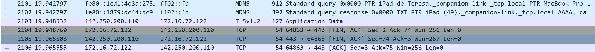

EJ_3. Analiza los headers de las peticiones cuando inicias sesión en el Moodle y comprende
cómo se obtiene el token. Para ello, necesitamos saber de dónde salen TODOS los
datos sensibles que se envían.

-
EJ_4.¿A qué puerto se reciben normalmente las peticiones del protocolo HTTP? ¿A qué
capa del modelo TCP/IP se encuentra el protocolo HTTP? ¿Y los protocolos TCP,
UDP, e IP?

-En el puerto 80 y tambien se puede usar el 8000 y 8080
-En la capa de aplicación
-En la capa de transporte
EJ_5.¿Cuál es el significado de la siguiente respuesta de un servidor?

-indica que el recurso solicitado se ha movido temporalmente a la URL proporcionada por el encabezado Ubicación.
 Un navegador redirige a esta página pero los motores de búsqueda no actualizan sus enlaces al recurso

EJ_6.Utilizando el filtro de captura para la interfaz de red de Wireshark, analiza la petición
al host: www.google.com. Mostrando la cabecera IP, la dirección IP de tu ordenador y
la del servidor. Comprueba que, poniendo esa IP en el navegador, accedas a Google.

Y poniendo la ip 142.250.200.110 me lleva google
